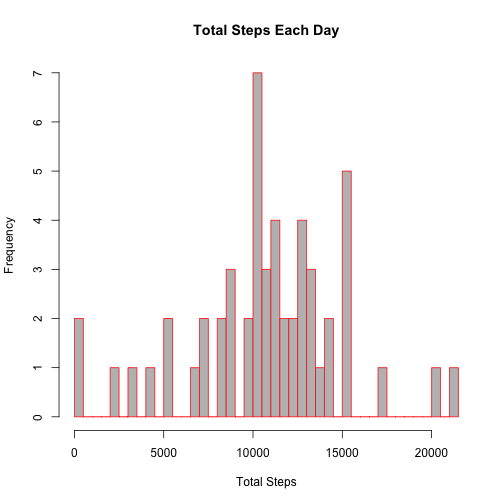
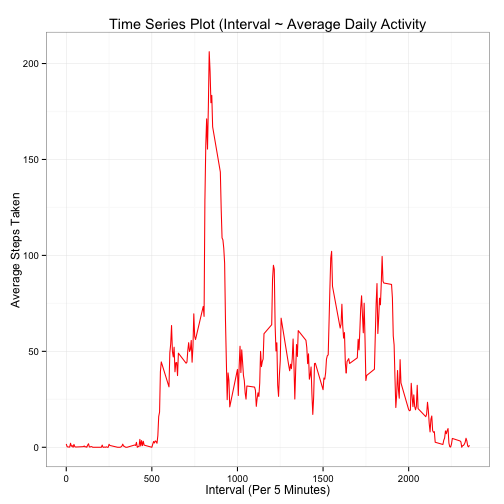
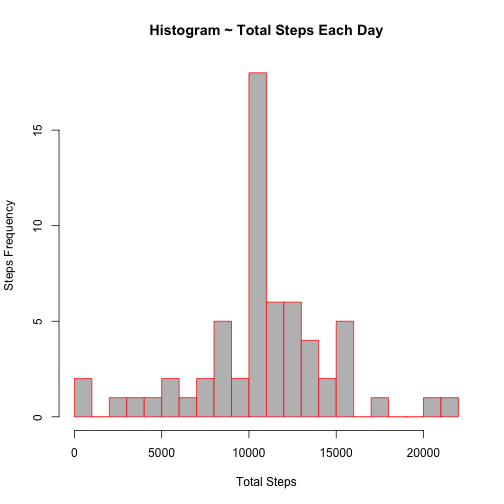
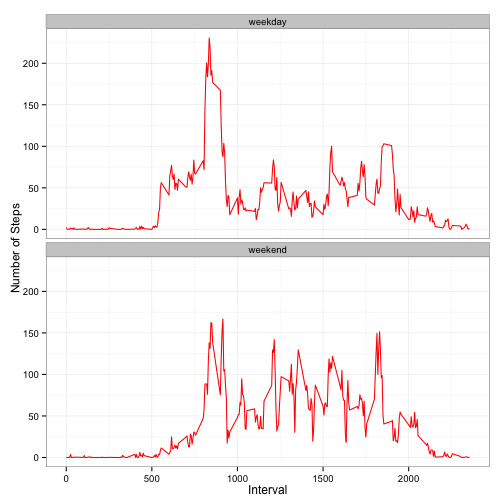

# Reproducible Research - Peer Assessment 1
- [Loading and preprocessing the data](#loading-and-preprocessing-the-data)
- [What is mean total number of steps taken per day?](#what-is-mean-total-number-of-steps-taken-per-day)
- [What is the average daily activity pattern?](#what-is-the-average-daily-activity-pattern)
- [Imputing missing values](#imputing-missing-values)
- [Are there differences in activity patterns between weekdays and weekends?](#are-there-differences-in-activity-patterns-between-weekdays-and-weekends)

***********


# Loading and preprocessing the data

## 1. Load the data (i.e. `read.csv()`)

Calculated the exact number of rows to be read via <span style="color:red;">`wc -l activity.csv`</span> command.

**Assumption**: Correct current working directory and activity.zip been extracted.


```r
act.data <- read.csv(file = "activity.csv",header = TRUE, nrows = 17569, stringsAsFactors = FALSE)
```

## 2. Process/transform the data (if necessary) into a format suitable for your analysis

As date and interval are in separate columns, lets combine and add new column <span style="color:red;">`datetime`</span>. Then peek into the data using <span style="color:red;">`glimpse`</span>.


```r
library(package = "lubridate", warn.conflicts = FALSE, quietly = TRUE)
library(package = "dplyr", warn.conflicts = FALSE, quietly = TRUE)
act.data <- tbl_df(act.data)
act.data <- mutate(act.data, datetime = ymd(date) + dminutes(x=interval))
glimpse(act.data)
```

```
## Observations: 17568
## Variables:
## $ steps    (int) NA, NA, NA, NA, NA, NA, NA, NA, NA, NA, NA, NA, NA, N...
## $ date     (chr) "2012-10-01", "2012-10-01", "2012-10-01", "2012-10-01...
## $ interval (int) 0, 5, 10, 15, 20, 25, 30, 35, 40, 45, 50, 55, 100, 10...
## $ datetime (time) 2012-10-01 00:00:00, 2012-10-01 00:05:00, 2012-10-01...
```


# What is mean total number of steps taken per day?

##1. Make a histogram of the total number of steps taken each day


```r
hist.data <- act.data %>% group_by(date) %>% summarise(total.steps = sum(as.numeric(steps)))
hist(hist.data$total.steps, col = "gray", border = "red" , xlab = "Total Steps", breaks = 60, main = "Total Steps Each Day")
```

 

##2. Calculate and report the mean and median total number of steps taken per day


```r
old.mean <- mean(x = hist.data$total.steps, na.rm = TRUE)
old.mean
```

```
## [1] 10766.19
```


```r
old.median <- median(x = hist.data$total.steps, na.rm = TRUE)
old.median
```

```
## [1] 10765
```

# What is the average daily activity pattern?

## 1. Make a time series plot (i.e. type = "l") of the 5-minute interval (x-axis) and the average number of steps taken, averaged across all days (y-axis)


```r
library(package = "ggplot2", warn.conflicts = FALSE, quietly = TRUE)
plot.data <- act.data %>% group_by(interval) %>% summarise(steps = mean(steps, na.rm = TRUE))
g <- ggplot(data = plot.data, aes(x = plot.data$interval, y = plot.data$steps))
g <- g + geom_line(color = "red")
g <- g + labs( title = "Time Series Plot (Interval ~ Average Daily Activity", x = "Interval (Per 5 Minutes)" , y = "Average Steps Taken")
g <- g + theme_bw()
g
```

 

## 2. Which 5-minute interval, on average across all the days in the dataset, contains the maximum number of steps?


```r
five.steps <- plot.data[which.max(plot.data$steps),]
five.steps
```

```
## Source: local data frame [1 x 2]
## 
##   interval    steps
## 1      835 206.1698
```

We can say that, <span style="color:red;">835</span> 5-minute interval has maximum steps of <span style="color:red;">206.1698113</span>.

Now,let's see the time for the above interval.


```r
v <- filter(act.data, interval == as.numeric(plot.data[which.max(plot.data$steps),][1]) ) %>% nth(n=4) %>% first()
t <- strftime(v, format="%H:%M:%S", tz="UTC")
t
```

```
## [1] "13:55:00"
```

Everyday at <span style="color:red;">13:55:00</span>, we have maximum number of steps.

# Imputing missing values

## 1. Calculate and report the total number of missing values in the dataset (i.e. the total number of rows with NAs)


```r
length(which(is.na(act.data)))
```

```
## [1] 2304
```

## 2.Devise a strategy for filling in all of the missing values in the dataset. The strategy does not need to be sophisticated. For example, you could use the mean/median for that day, or the mean for that 5-minute interval, etc.

We will fill the <span style="color:red;">`NA`</span> values with the mean for that 5-minute interval.

## 3.Create a new dataset that is equal to the original dataset but with the missing data filled in.


```r
new.mean <- act.data %>% group_by(interval) %>% summarise(steps = mean(as.numeric(steps), na.rm = TRUE))
```

Get the indices for <span style="color:red;">`NA`</span> values.


```r
indices <- which(is.na(act.data))
```

Now fill <span style="color:red;">`NA`</span> values in the data set. Copy the original data and <span style="color:red;">in-place replace `NA`</span> in the original data set.


```r
modified.act.data <- act.data
for(i in 1:length(indices))
{
    modified.act.data$steps[indices[i]] <- new.mean$steps[new.mean$interval == modified.act.data$interval[indices[i]] ]
}
```

<span style="color:red;">`NA`</span> existence check on both original and modified data set.


```r
len.modified <- length(which(is.na(modified.act.data)))
len.orig <- length(which(is.na(act.data)))
```

Original has <span style="color:red;">2304</span> NA values and modified has <span style="color:red;">0</span> NA values.

## 4.Make a histogram of the total number of steps taken each day and Calculate and report the mean and median total number of steps taken per day. Do these values differ from the estimates from the first part of the assignment? What is the impact of imputing missing data on the estimates of the total daily number of steps?


```r
new.hist.data <- modified.act.data %>% group_by(date) %>% summarise(total.steps = sum(as.numeric(steps)))
hist(new.hist.data$total.steps, col = "gray", border = "red" , xlab = "Total Steps", breaks = 20, main = "Histogram ~ Total Steps Each Day", ylab = "Steps Frequency")
```

 

**New mean and median values reporting**


```r
new.mean <- mean(x = new.hist.data$total.steps, na.rm = TRUE)
new.mean
```

```
## [1] 10766.19
```


```r
new.median <- median(x = new.hist.data$total.steps, na.rm = TRUE)
new.median
```

```
## [1] 10766.19
```

**Comparison between old and new (mean and median)**

New Mean        |   Old Mean        |   New Median      |   Old Median
---------       |   ---------       |   ---------       |   ---------
1.0766189 &times; 10<sup>4</sup>    |   1.0766189 &times; 10<sup>4</sup>    |   1.0766189 &times; 10<sup>4</sup>  |   1.0765 &times; 10<sup>4</sup>

After filling `NA` values :

* No difference in Mean.
* Slight difference in Median.

**Impact of imputing missing data**

From both histograms, we can say that there is slight increase in the peak which is due to the change in the new median converging towards new mean.

Overall, light impact on the outcome.

# Are there differences in activity patterns between weekdays and weekends?

For this part the weekdays() function may be of some help here. Use the dataset with the filled-in missing values for this part.

## 1. Create a new factor variable in the dataset with two levels – “weekday” and “weekend” indicating whether a given date is a weekday or weekend day.


```r
day.of.week <- sapply(modified.act.data$datetime, weekdays)
day.type <- ifelse(day.of.week %in% c("Monday", "Tuesday", "Wednesday", "Thursday", "Friday"),yes = "weekday" , no = "weekend")
modified.act.data$daytype <- as.factor(day.type)
str(modified.act.data$daytype)
```

```
##  Factor w/ 2 levels "weekday","weekend": 1 1 1 1 1 1 1 1 1 1 ...
```

## 2.Make a panel plot containing a time series plot (i.e. type = "l") of the 5-minute interval (x-axis) and the average number of steps taken, averaged across all weekday days or weekend days (y-axis)


```r
plot.data <- aggregate(modified.act.data$steps ~ modified.act.data$interval + modified.act.data$daytype, modified.act.data, mean)

colnames(plot.data) <- c("interval", "daytype", "steps")
g <- ggplot(data = plot.data, aes(x = interval, y = steps))
g <- g + geom_line(color = "red")
g <- g + facet_wrap(~ daytype, nrow=2, ncol=1)
g <- g + labs( x = "Interval" , y = "Number of Steps")
g <- g + theme_bw()
g
```

 

